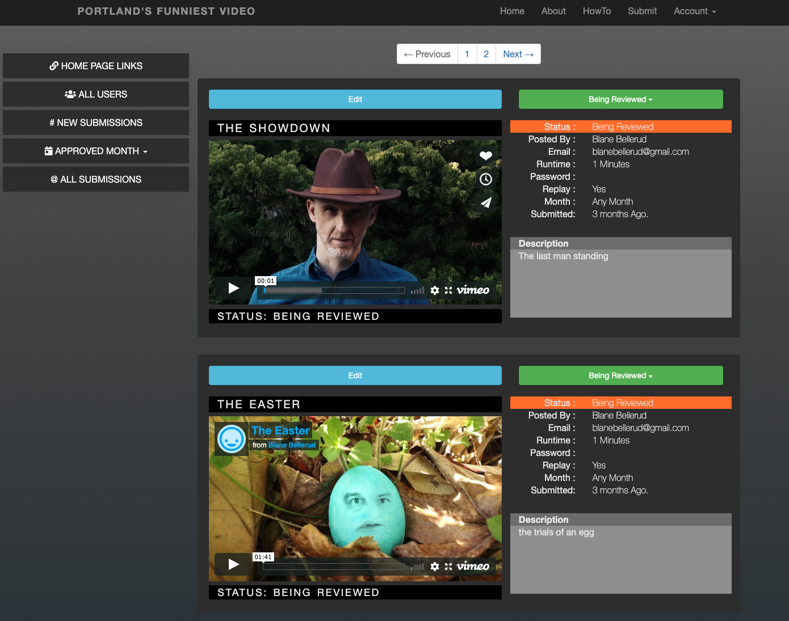

# PORTLAND'S FUNNIEST VIDEO

#### _Ruby On rails_

[Portland's Funniest Video Site](http://www.portlandsfunniestvideo.com/)

#### By: **Dusty McCord**



## Description

This site provides a place for users to submit their short films and for administrators to review the submissions and approve for a specific month.

## Specifications:

- Users can sign up for an account.
- Users can submit a link from youtube or vimeo.
- Admins can see new submissions.
- Admins can assign a submission for a specific month.
- Admins can view a month and see all approved submissions and a total run time.

## Setup/Installation Requirements

_Please make sure you have ruby on rails installed._

### Clone this repository

_Enter the following commands in Terminal (macOS) or PowerShell (Windows):_

```shell
cd desktop
git https://github.com/dustatron/pdx-comedy-filmfest.git
cd pdx-comedy-filmfest
```

_Install dependencies_

```shell
bundle install
```

_Create a database_

```shell
rails db:migrate
```

_Run this application by entering the following command in Terminal (macOS) or PowerShell (Windows):_

```shell
rails s
```

_To view/edit the source code of this application, open the contents of the TreasureSweepGame.Solution directory in a text editor or IDE of your choice (e.g., to open all contents of the directory in Visual Studio Code on macOS, enter the command_ `code .` _in Terminal at the root of the TreasureSweepGame.Solution directory)._

## Technologies Used

- Git
- HTML
- CSS
- JavaScript
- Ruby ~> '2.5.1'
- Ruby on Rails ~> '5.2.0'

## License

Licensed under the MIT license.

&copy; 2020 - Michelle Morin, Jamison Cozart, Dusty McCord, Patrick Kille

This README would normally document whatever steps are necessary to get the
application up and running.

- Ruby version
  '2.5.1'

- Database creation

```shell
rails db:migrate
```
